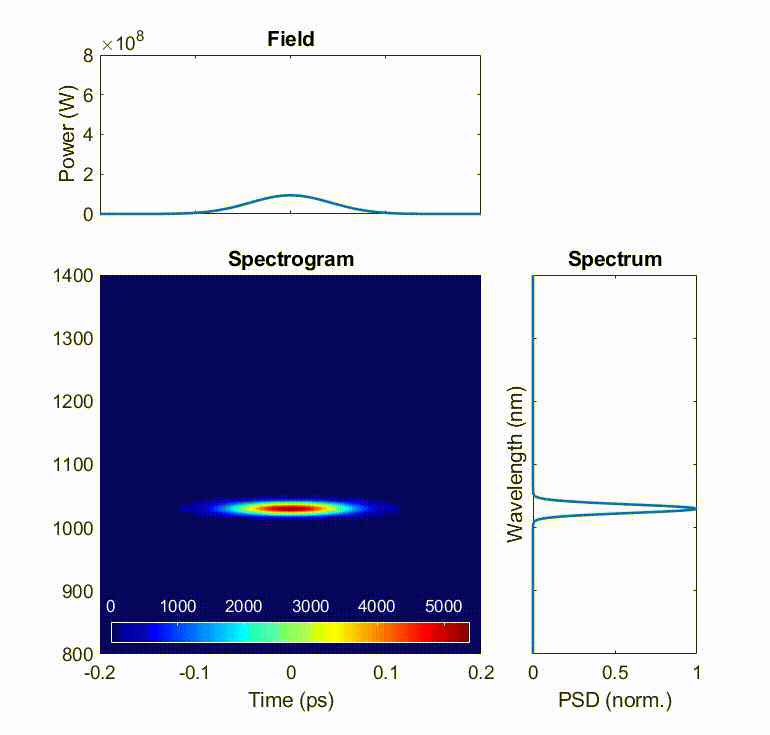
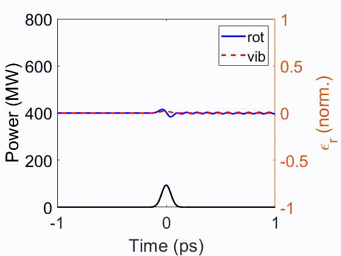
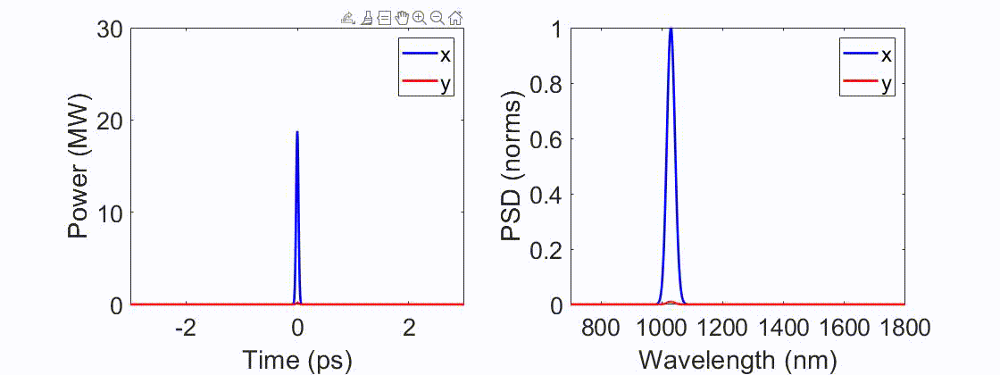
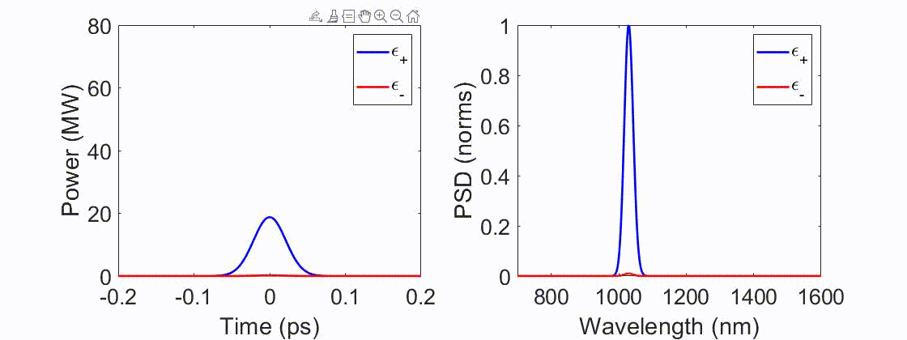
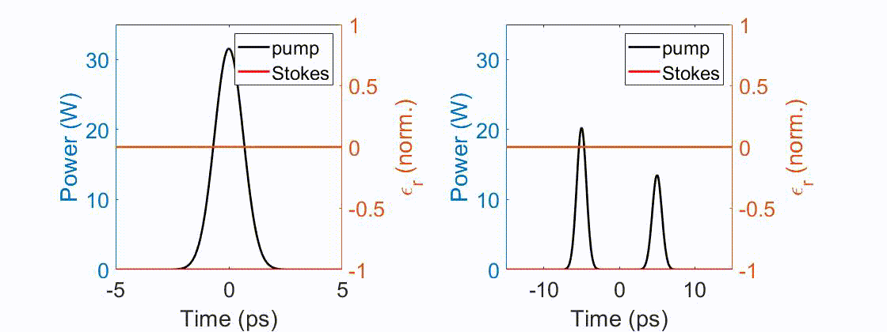

# gas_UPPE
This is the shared package to simulate pulse propagation in a gas-filled hollow-core fiber with MM-UPPE with MATLAB.

It is useful for simulating pulse compression in gases, Raman physics (e.g. soliton self-frequency shift, Raman generation, or multidimensional solitary state generation), and photoionization-induced blueshift, etc.

## Capabilities:
1. It solves the pulse propagation with
   - [RK4IP](http://www.sciencedirect.com/science/article/pii/S0010465512004262) (Runge-Kutta under the interaction picture) if single-mode.
   - [MPA](https://ieeexplore.ieee.org/document/8141863) (massively parallel algorithm) if multimode.

> [!NOTE]
> I know that split-step algorithm is common, but I'd like to advocate people to switch to RK4IP since RK4IP has a higher-order truncation error, which allows higher precision or larger step size (and faster simulation).

2. Adaptive step-size control are implemented for both RK4IP and MPA, which improves the performance and allows users to be free from worrying the reliability of a simulation.

> [!NOTE]
> Although adaptive-step-size control for RK4IP isn't new with published papers, adaptive-step-size control for MPA is new. I didn't publish a separate paper discussing this numerical scheme, which is perhaps the fastest and the most convenient numerical scheme for general multimode situations (as in step-index, graded-index, or hollow-core fibers, etc.) by far (written on 2/14/2024). The implementation detail is described in the supplement of [[1]](#references-our-papers).

3. Support both scalar and polarized scenarios, controlled with `sim.scalar=true/false`.
4. The gas encompasses noble (He, Ne, Ar, Kr, Xe) and Raman-active gases (H2, N2, O2, air, and CH4). 
5. Support photoionization with the PPT model. Check the supplement of [[4]](#references-our-papers).
6. Support Raman computations with both scalar and polarized scenarios, as well as with both vibrational and rotational Raman scattering.

> [!NOTE]
> This package should be the world's first correct implementation of polarized Raman simulations with both vibrational and rotational Raman scattering (scalar modeling has been known for years already). Due to the connection of angular momentum for the rotational Raman scattering, it's long been unclear how rotational Raman scattering affects nonlinear processes with polarization coupling. Although there are a few prior studies, I would define them as qualitative (or not quite fully quantitative) investigations. This package is able to solve quantitatively all the nonlinear interactions, electronic and both types (vibrational and rotational) of Raman scattering. In cases other than a single linearly polarized light involved in a decently nonlinear process, polarization coupling resulting from rotational Raman scattering is strong and requires significant attention. For details of the underlying physics, please read [our open-access paper](https://doi.org/10.1063/5.0189749).

7. Support noise-seeded processes, such as spontaneous Raman scattering, with [the newly-developed noise model](https://doi.org/10.48550/arXiv.2410.20567).
8. For multimode, GPU computations (with Nvidia CUDA) is highly recommended. I have written a lot of CUDA files to speed up simulations. It is controlled by `sim.gpu_yes=true/false`.

## Fourier-Transform tutorial
Since I've seen many misuse of Fourier Transform, I wrote [this tutorial](https://doi.org/10.48550/arXiv.2412.20698). Please take a look. Briefly speaking for one misuse, it's necessary to use MATLAB's `ifft` for Fourier Transform into the spectral domain.

## How to activate CUDA for GPU computing in MATLAB:
Typically MATLAB deals with this, but there are still come steps to follow before CUDA can really be used, especially when compiling .cu files to generate .ptx files. Below I show only steps for Windows. For linux, please search for their specific steps. I've never used Mac, so I cannot comment anything on this; some functions need to be revised for extended capabilities for Mac as far as I know. 
1. Install [CUDA Toolkit](https://developer.nvidia.com/cuda-toolkit)
2. Install [Visual Studio Community](https://visualstudio.microsoft.com/vs/community/). Only **Desktop development with C++** is required. If it later says that it needs to install some other components due to the dependency issues, also install them.

3. Add required path of Visual Studio to computer's environmental PATH; otherwise, MATLAB, during compiling .cu files, will say "cl.exe" cannot be found.

4. Restart the computer if something is wrong. Connections between MATLAB and CUDA or Visual Studio requires restarting to be effective.
> [!WARNING]
> MATLAB supports only a certain version of CUDA and GPUs ([support list](https://www.mathworks.com/help/releases/R2021b/parallel-computing/gpu-support-by-release.html)). CUDA or GPU that is too old just isn't supported.

## References (our papers):
1. [Multimode gain](https://doi.org/10.1364/JOSAB.500586)
2. [Raman scattering](https://doi.org/10.1063/5.0189749)
3. [Noise modeling](https://doi.org/10.48550/arXiv.2410.20567)
4. [LWIR generation in H2](https://opg.optica.org/josab/abstract.cfm?URI=josab-40-4-796)

## Demonstrations:
- **Soliton self-compression**  
The pulse undergoes soliton self-compression in H2, creating an ultrashort temporal peak. When the pulse shrinks in time, the sharp peak "impulsively" excites any Raman whose variation rate is slower than the pulse, i.e. those Raman have smaller transition frequencies. Because typically rotational Raman has a smaller transition frequency, it is impulsively excited earlier than the vibrational one here. Vibrational Raman-induced index is impulsively excited after the pulse duration keeps reducing such that the pulse temporal variation rate is higher than the Raman index change rate.  
Source: "Examples\Soliton compression (use anti-resonant fiber)"  

- **Polarized soliton self-frequency shift (SSFS)**  
After soliton fission into many solitons, the pulse undergoes soliton self-frequency shift in H2, where the pulse redshifts continuously due to intrapulse Raman scattering.  
In the examples here, I demonstrate with incident pulse in either (left) linear polarization or (right) circular polarization. Because cross-circularly-polarized stimulated Raman scattering exhibits a Raman gain that doesn't suffer from any four-wave-mixing gain suppression, its strength can be even 100 times larger than the cross-linearly-polarized gain-suppressed one. This strong Raman-induced polarization coupling deteriorates the SSFS (see [[2]](#references-our-papers) for details).  
Here, the linearly-polarized case can redshift up to almost 1800 nm, while the circularly-polarized one undergoes something more like spectral broadening, rather than a clean spectral shift of a pulse.  
Source: "Examples\SSFS (use anti-resonant fiber)"  

- **Transient Stokes generation**  
The pulse undergoes Transient Raman Stokes generation in H2. If there is only one pulse, the transient Raman generation is the strongest at the trailing edge, limiting the generation efficiency to around 50%. If there are two pulses, the first "stronger" pulse will generate Stokes earlier, whose interfered temporal spikes "impulsively" drives the long-lasting index wave, further driving the Stokes generation in the second pulse. The second pulse thus undergoes Stokes generation throughout its entire pulse.  
The long-lasting index wave doesn't need to be super strong to drive the second-pulse Stokes generation, so it isn't clear in the figure. However, we can clearly see that, compared with the single-pulse Stokes generation, the double-pulse generation efficiently creates a Stokes signal throughout the entire pump pulse.  
Source: "Examples\Stokes generation (use capillary)"  

## Notes:
There is a `readme.pdf` in the `Documentations/` folder. Please find details of how to use this code in it. However, the fastest way to learn how to use this package is to learn from the examples in the `Examples/` folder.

The structure of this code is developed similar to [our solid-core counterpart](https://github.com/AaHaHaa/MMTools). For optimization details of multimode (transverse modes and polarization modes), please see the supplement of our paper on [multimode gain fiber](https://doi.org/10.1364/JOSAB.500586). For details of gas modeling, please read the supplement of [[2]](#references-our-papers).  

I'm Yi-Hao Chen, the author of the code and from Frank Wise's group at Cornell Applied Physics. Feel free to ask questions here or by sending me an email (email address is in my paper).

Please don't forget to cite our paper if you find this code useful in your work. I, the young and early-career researcher, need your support. Similarly, if you need help or have questions about the code, please feel free to send me an email.

### Upgrade this code together:
If you have any other function that you think important, please point it out in Github's discussions or send me an email. For example, perhaps you would like to add more gas species. I implement with current gases just due to my own research interest.

## History:
* 5/11/2024: 
I added some examples. APL Photonics data files are updated so that they can be run correctly.  
A bug regarding SRS under gradient pressure is also fixed.  
8pm (GMT-4): Extensive comments are added to examples.
* 5/14/2024: 
I extended the photoionization model to gases other than H2 and He.
* 7/24/2024: 
Fixed Ar $n_2$ to the should-be correct value. See the comment in `gas_info()` for details.
* 10/29/2024: 
Update the code with the newly-developed noise model with [the finally-published paper](https://doi.org/10.48550/arXiv.2410.20567).